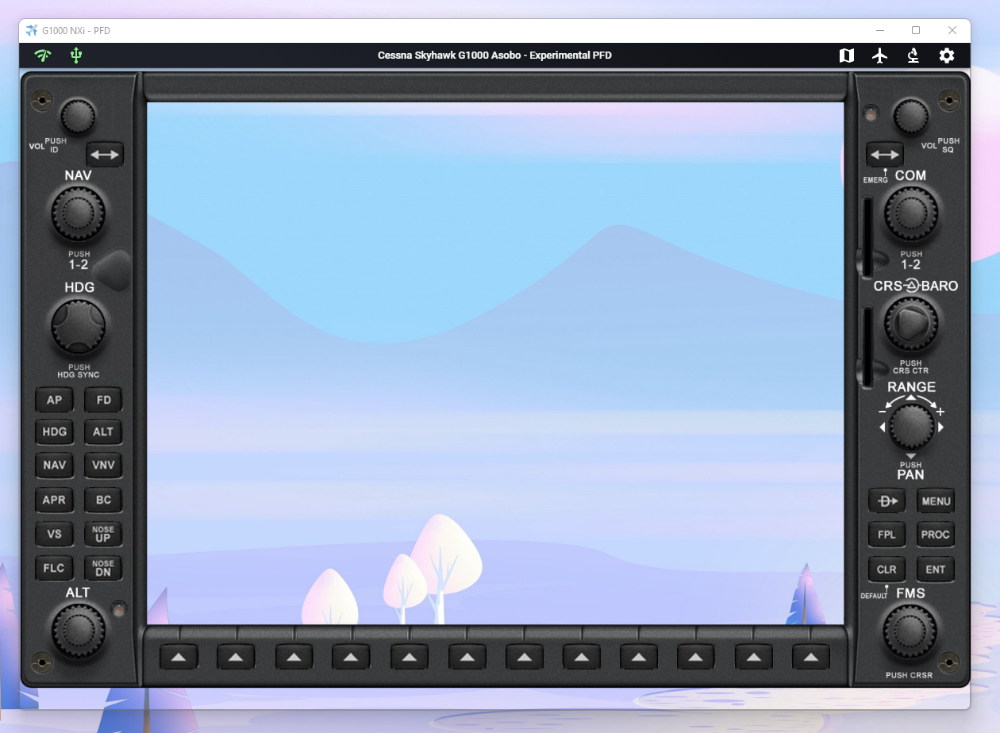
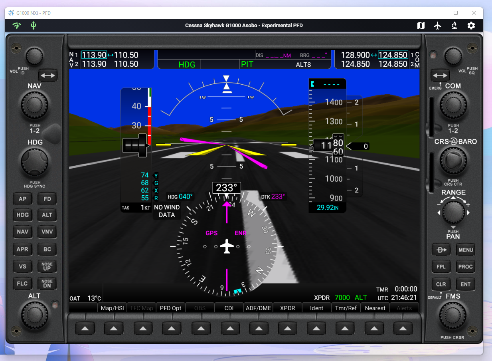
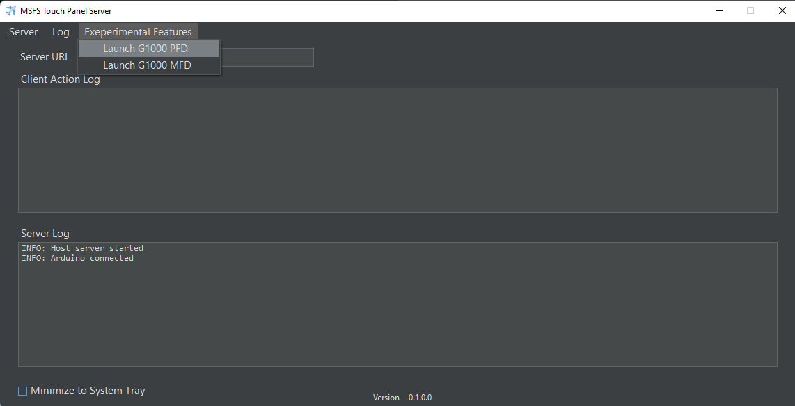
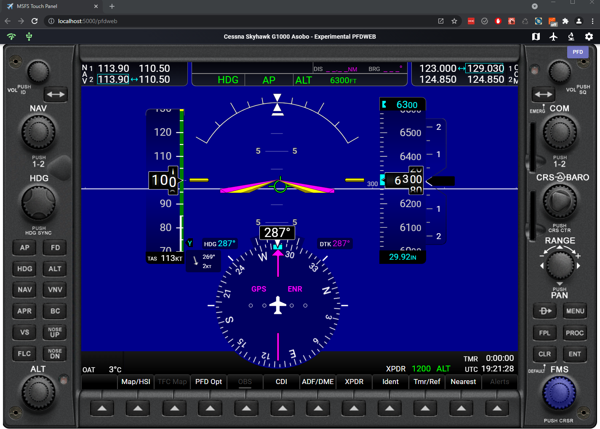

# MSFS Touch Panel Experimental Feature

# Experimental Feature #1 - G1000 NXi PFD/MFD

### IMPORTANT! This experimental feature only works with Arduino input currently.

The concept of this experimental feature is to be able to code a responsive web based PFD/MFD control frame using ReactJS which then can host pop out panels from MSFS similar to Air Manager. To achieve this, a .NET windows form container uses a webview to host a PDF/MFD control frame. To achieve transparency throughout, the web page, webview and windows form will need to set the correct transparency to allow the PDF/MFD pop out panel to show through. The arduino rotary encoder input will behave similar to the Knobster by Air Manager. By touching the corresponding dial on PFD/MFD frame, the rotary encoder will serve input for that selected dial.

  
   
    

 
## How to Use
1. Launch PFD and/or MFD panel from the server application. (MSFS Touch Panel Server.exe) 

 

2. Recommendation is to put the PFD/MFD frame on a separate screen, preferable a tablet screen (using tool like [spacedesk](https://www.spacedesk.net/)) or an external touch enabled portal monitor.

3. Resize or preferably maximize the PFD/MFD frame on the screen. The frame will keep its aspect ratio from the web page responsive design.

4. Pop out corresponding G1000 NXi PFD/MFD panel from the game and move it within the frame. You can use any 3rd party tool or my [pop out manager tool](https://github.com/hawkeye-stan/msfs-popout-panel-manager) to save the pop out location so you don't have to do this on every flight.

5. Press the gear icon in the menu bar, make sure "Use Arduino" is enabled.
 
6. All the buttons on the PFD/MFD frame behave just like touch enable buttons.

7. To control any of the dials, first press on the dial, it will then highlighted in purple. You can then control it using the Arduino encoder.

8. You can go back and forth between the touch panel application (ie. to see the moving map) and the pop out frame by pressing the "Microscope" icon in the menu bar.

* To directly access and/or debug the PFD/MFD web page frame. You can type in following URL in the browser:

	http://localhost:5000/pfd 

	http://localhost:5000/mfd 

# Experimental Feature #2 - Pure Web-based G1000 NXi PFD/MFD

### IMPORTANT! This experimental feature only works with Arduino input currently. You can still run the panel as display only without the button controls.

 

## How to Use

1. Launch the server application. (MSFS Touch Panel Server.exe)   

2. Start the game and go into a flight. When the flight is fully loaded, go to next step.

3. Directly access PFD/MFD web page. You can type in following the URL in the browser:

	http://localhost:5000/pfdweb

	http://localhost:5000/mfdweb

If the screen doesn't come up, keep reloading the page or see inspector in browser's development panel to see are there any javascript error.	
Optional: Run as display only

	http://localhost:5000/experimental/g1000nxi/g1000nxi_pfd.html
	
	http://localhost:5000/experimental/g1000nxi/g1000nxi_mfd.html
	
## Technical Detail

How this feature works is by using Coherent GT debugger feature that is part of MSFS SDK. (I believe you do not need to install the SDK to use this feature). When MSFS starts, a local Coherent GT debugging port is opened at:

http://localhost:19999		can also access remotely by using game PC IP address.

Initially by accessing http://localhost:19999/pagelist.json, you will get a list of current render views with page ID as the game loads. The view will change as you go from screen to screen. 

By navigating around web browser CORS requirement, my app's web link at http://localhost:5000 is able to access debugger's websocket connection at 

ws://localhost:19999/devtools/page/XXX

XXX will be different every time a flight is started.

The websocket message returns generated HTML page as DOM nodes on demand. By parsing different types of incoming websocket messages, my app was able to reconstruct the entire DOM tree in real time and render it inside a web browser. Each websocket message has a piece of information with attributes and node relationship for reconstruction. Unfortunately, the reconstruction is not straight forward with lots of tricky determination of node content and node parsing as well as one-offs on Asobo's side as well as G1000 NXi side. Incorrect reconstruction and parsing will usually kill the browser with CPU usage spike and memory leak. 

Two things I'm not able to get information currently:

1. By accessing a pop up sub menu inside a panel, if the sub menu is scroll-able, the scrollbar is implemented as SVG instead of HTML overflow. So even the scrollbar is moving, the overflow is not moving which is most likely control by Javascript running on Coherent side. 

2. Bing Map (major) - images with JS_BING_XXXXXXXXX are not available since they're not PNG or other image type. Most likely they're stream images on the Coherent server side. The debugger web socket is not able to return this screenshot. I tried to injrect javascript to MSFS vcockpit scripts to convert the stream to base64 using various method (Canvas, blob, etc) but failed.

Anyway, it is fun to do this feature even though it is not perfect. But being able to run an entire G1000Nxi PFD with minimal code change other than dumping the html_ui folder into the web app is a win!

Next thing to tackle is Flybywire A320 because the pop out panel seems to have fewer MS Bing images.

Code for this experiment feature, mostly in module.js file is available [here](reactclient/public/experimental/g1000nxi/)