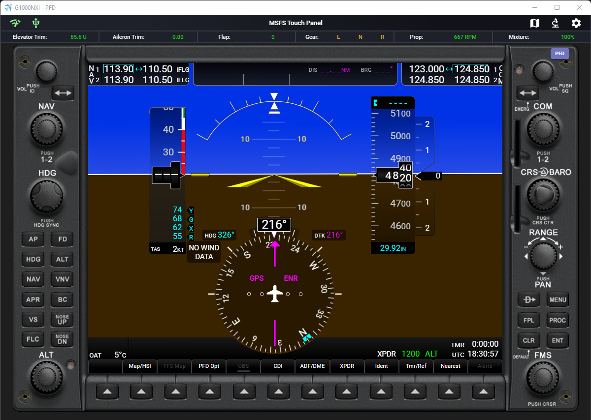
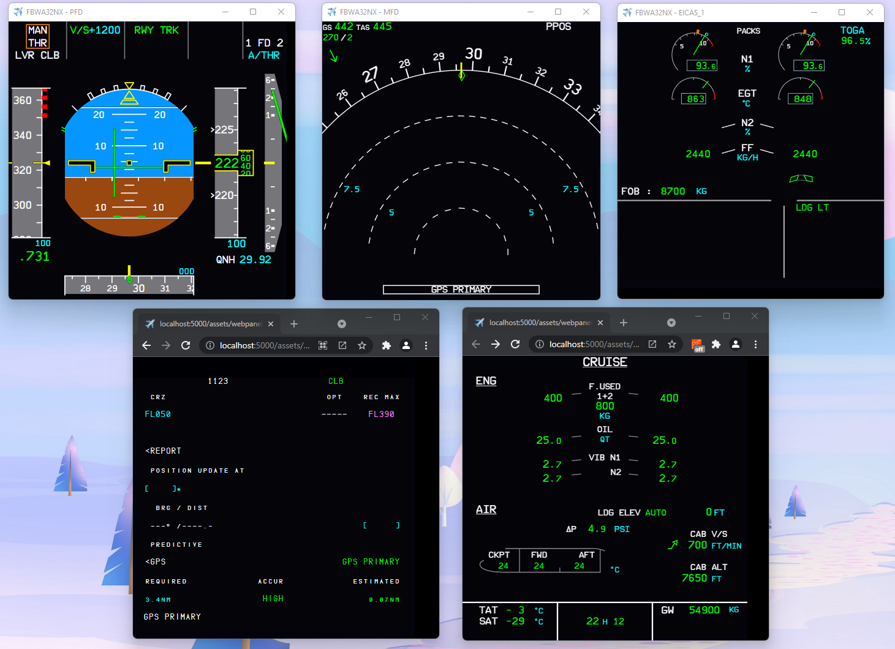
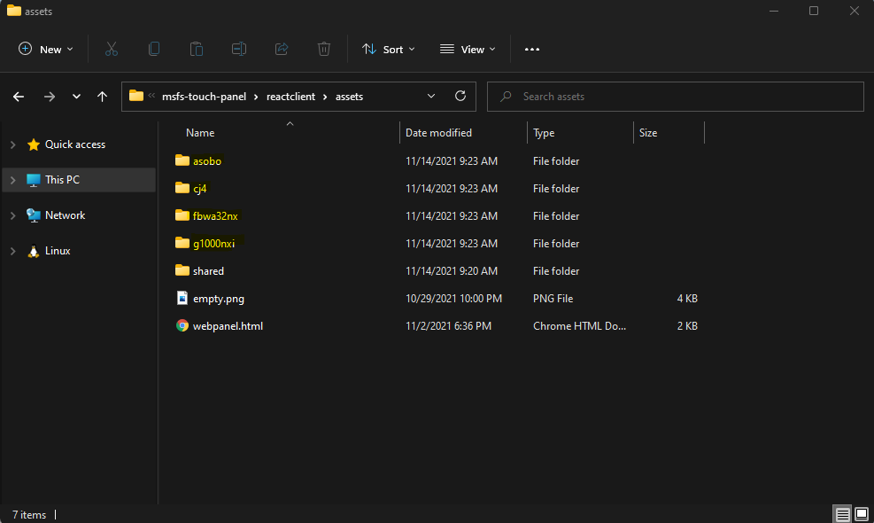
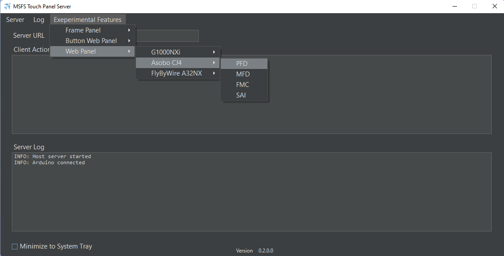

# MSFS Touch Panel Experimental Feature #2
# Proof-of-Concept pure web-based panel for G1000 NXi PFD/MFD and other planes

## IMPORTANT! This experimental feature only works with Arduino input currently if you decide to using G1000 NXi button frame. You can still run the panel as display only without the button controls for all supported plane.

  
   

 

# Supported Plane

* Planes using G1000 NXi add-on
* FlyByWire A32NX
* Original MSFS Asobo CJ4 (with on add-on that modified HTML_UI)

 

# How to Install?

To recreate the replica of the HTML panel, the HTML assets for each supported plane has to be referenced in the app. To do this, symbolic folder links have to be created against certain MSFS game folders for the  HTML_UI assets.

Please run the following command script from the app folder in Windows Powershell with **ADMINISTRATOR** privileges. Without administrator privileges, symbolic link cannot be created.

**To create links:**

/plugin-extension/webpanel/create_symbolic_link.ps1

**To remove links:** 

/plugin-extension/webpanel/remove_symbolic_link.ps1

After running the create script, 4 new folders are created and inside them, you should see symbolic link folders that link to the game folders.

  

 

# How to Use?

1. Launch the server application. (MSFS Touch Panel Server.exe)

2. Start the game and launch into a flight. When the flight is fully loaded, go to next step.

3. Directly access PFD/MFD web page with a browser. You can type in following the URL in the browser. If you want to access the panel from a different device, just change localhost to your PC IP address:

* G1000 NXi

	http://localhost:5000/webpanel/g1000nxi/pfd

	http://localhost:5000/webpanel/g1000nxi/mfd
	
	http://localhost:5000/buttonpanel/g1000nxi/pfd

	http://localhost:5000/buttonpanel/g1000nxi/mfd

* G1000 CJ4

	http://localhost:5000/webpanel/cj4/pfd

	http://localhost:5000/webpanel/cj4/mfd
	
	http://localhost:5000/webpanel/cj4/fmc

	http://localhost:5000/webpanel/cj4/sai
	
* FlyByWire A32NX

	http://localhost:5000/webpanel/fbwa32nx/pfd_template_1

	http://localhost:5000/webpanel/fbwa32nx/nd_template_1
	
	http://localhost:5000/webpanel/fbwa32nx/eicas_1

	http://localhost:5000/webpanel/fbwa32nx/eicas_2
	
	http://localhost:5000/webpanel/fbwa32nx/mcdu
	
	http://localhost:5000/webpanel/fbwa32nx/dcdu
	
	http://localhost:5000/webpanel/fbwa32nx/isis
	
	http://localhost:5000/webpanel/fbwa32nx/fcu
	
	http://localhost:5000/webpanel/fbwa32nx/rmp

If panel screen doesn't come up after a few seconds, please reloading the page or see inspector in browser's development panel to see are there any javascript error.	

### OR you can launch the web page inside a window

  

 
 

# Technical Detail

How this feature works is by using Coherent GT debugger feature that is part of MSFS SDK. (You do not need to install the SDK to use this feature). When MSFS starts, a local Coherent GT debugging port is opened at:

http://localhost:19999		
 Or you can also access remotely by using game PC IP address.

By accessing http://localhost:19999/pagelist.json, you will get a list of current render views with page ID as the game loads. The view will change as you go from screen to screen within the game. 

By implementing code to solve web browser CORS requirement, the app's web link at http://localhost:5000 is able to access debugger's websocket connection at 

ws://localhost:19999/devtools/page/XXX

XXX will be different every time a flight is started.

The websocket message returns generated HTML page as DOM nodes on demand. By parsing different types of incoming websocket messages, the app was able to reconstruct the entire DOM tree in real time and render it inside a web browser. Each websocket message has a piece of information with attributes and node relationship for reconstruction. Unfortunately, the reconstruction is not straight forward with lots of tricky determination of node content, node parsing, bug workaround, as well as one-offs on Asobo's side as well as G1000 NXi side. Incorrect reconstruction and parsing will usually kill the browser with CPU usage spike and memory leak. 

The only thing I'm not able to get information currently is:

1. Bing Map - HTML image tag with src JS_BINGMAP_XXXXXXXXX are not available since they're not PNG or other image type. Most likely they're stream images on the Coherent server side which gets updated on-demand. The debugger web socket is not able to return this image. 

Anyway, it is fun to do this feature even though it is not perfect. But being able to run an entire G1000Nxi PFD with minimal code change other than dumping the html_ui folder into the web app is a win!

Code for this experiment feature, mostly in module.js file is available: [module.js](reactclient/public/assets/shared/module.js) and [webpanel.html](reactclient/public/assets/webpanel.html)