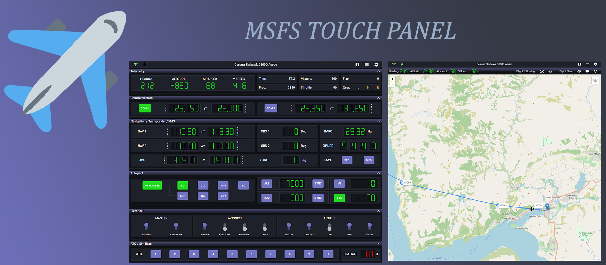
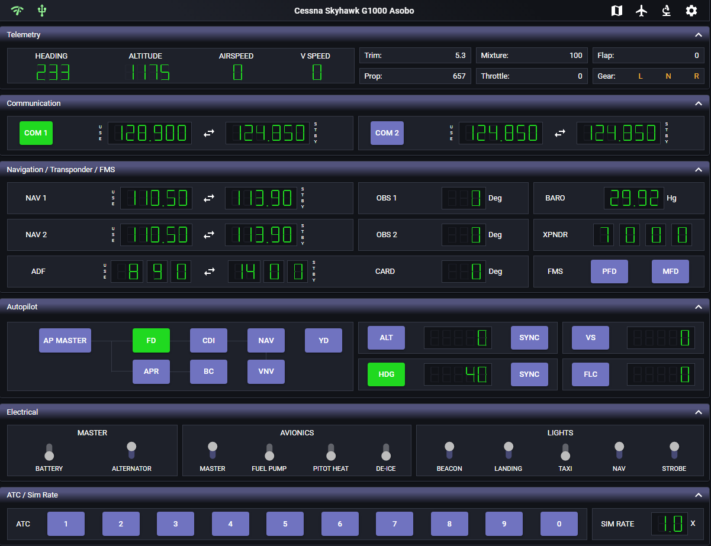
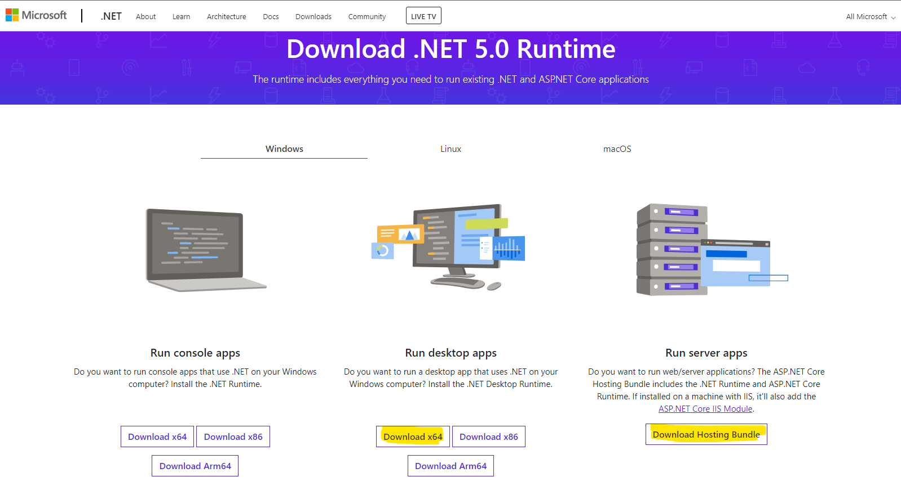
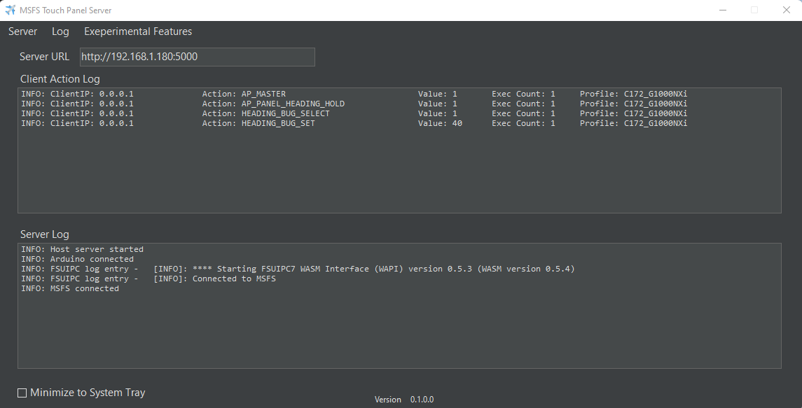

MSFS Touch Panel is a proof-of-concept web application for MSFS 2020 which focuses on touch inputs to make your flying more enjoyable! It is designed for an iPad and Android tablet with Arduino's input controls in mind to provide a simple DIY cockpit for all the casual sim fans out there. This application can also be used in any modern browser on PC or tablet with all features enabled. The initial release includes features such as:

 - [Experimental Feature #1](ExperimentalFeature.md): Screenshot #1 and #2 below. Similar to Air Manager by Sim Innovations, but a web-based G1000 NXi PFD/MFD transparent .NET WebView2 control frame with fully functional touch enabled switches and dials. Manually pop out these 2 panels from the game or use a [tool](https://github.com/hawkeye-stan/msfs-popout-panel-manager) and place them inside these panels to use the active touch screen controls.
 - [Experimental Feature #2](ExperimentalFeature.md): Screenshot #3 below. Building on top of experimental feature #1. I reverse engineered MSFS SDK CoherentGTDebugger and used the debugging web socket data messages to reconstruct G1000NXi PFD in web browser. Running this particular version of the panel has no FPS penalty compare to pop out panel. But major caveat is that although most items work, 2 things do not work at all and they are major especially for G1000NXi MFD. The 2 things are MS Bing Map and on screen sub-menu scrolling. Please see the experimental feature documentation for technical detail. This exercise is really fun and I am to prove running closed source coherent panel externally can be done (the hacky way) although it is not quite perfect. If someone can figure out how to extract and stream Bing Map in real time, the entire pop out panel problem may be solved.
 

  
   
   

 
## Main Application Feature

 - Input control profiles for (Default plane, C152 and C172 G1000 - using G1000 NXi addon)
 - Flight controls including the following:
	 - Telemetry display
	 - NAV/COM controls
	 - Autopilot controls
	 - FMS controls
	 - Basic electric controls (lights, pito heat / de-ice, power)
	 - ATC menu buttons
	 - Sim rate control with automatic speed up/slow down logic
	 - G1000 PFD/MFD controls
 - Moving map with Open Street Map / Google Map selection
	 - Automatic flight plan loading
	 - Fight following
 - Configuration settings
	 - Show / hide control panels as you see fit
	 - Customizable data refresh interval for UI controls and maps
	 - Configurable input method
		 - DIY Arduino knob / joystick input (similar to DIY Knobster by Sim Innovations) 
		 - Touch direct input
		 - Touch knob input
		 - Touch stepper input
 - Server side logging for programmers out there who want to see what is going on behind the scene

  

 

 
This project is developed with ReactJS front-end client and an ASP.NET core 5.0 back-end server application. Feature additions and bug fixes will be ongoing as I learn more about the inner workings of MSFS in order to create more advanced feature set, increase support for various airplane profiles, and continue to improve performance of the application.

# How to install?
Download the latest release [here](https://github.com/hawkeye-stan/msfs-touch-panel/releases) and unzip the content to a folder of your choice. **The server application must be installed on the PC running MSFS.**

 1. After unzipping the content, copy FSUIPC WASM module (within the
    unzipped folder "***plugin-extension/fsuipc-lvar-module***") to your MSFS Community
    folder. This is used to access HVAR / LVAR values in the simulation.
    You will find the community folder under:
    -    *MS Store users*: C:\Users\YOURUSERNAME\AppData\Local\Packages\Microsoft.FlightSimulator_8wekyb3d8bbwe\LocalCache\Packages
    -   *Steam users*: C:\Users\YOURUSERNAME\AppData\Roaming\Microsoft Flight Simulator\Packages\
  
 2. Download and install latest .NET 5.0 framework if being prompted. You've to install both the x64 desktop app runtime and server app runtime.
 

 
3. G1000 NXi patch (Optional)
Included in this application release is an input panel to control PFD and MFD for planes that uses G1000 NXi addon. These panels have softkeys at the bottom of the panel to control various panel functions. Unfortunately, there is no easy way to read the sofkey's label and status. So, I've modified the G1000NXi files and encode these softkey variables as LVAR to be used by the application. Please see [detail installation instruction](plugin-extension/G1000NXi) in how to patch the G1000 NXi addon files. You can find the patch files under the folder "***plugin-extension/G1000NXi/vX.X***". The patch version should match the G1000 NXi version in the market place. I will continue to make new G1000 NXi patch release to mirror the additional functionalities that Working Title team put into their G1000 PFD/MFD panels.

# How to run?
 - Make sure your tablet or browser are connected to the same internal network as the touch panel server application.
 - Run ***MSFS Touch Panel.exe*** within the unzipped folder. This is the server application. You have the option to minimize the server to Windows tray or just run it the background.
 

 - Open a browser from your computer or tablet and enter the IP address given by the server application. It should be something like ***192.168.1.XXXX:5000***. If you're running the client application on the same computer as the server, you can use ***localhost:5000*** as the IP address. 
 - The client application will connect and disconnect automatically when you start or quit MSFS.
 - Tips!! For iOS, you can add the browser page to home screen to better utilize the screen real estate by running the application as a full screen app.
 
# What's next for development of this project?
 - Expand support for plane profiles
 - Increase support for plane control functions
 - Improve flight path drawing (with more complex path calculation and smoother flight path display)
 - Possibly to improve flight plan departure and landing display with RNAV/ILS/STAR data (similar to the MSFS/Navigraph data support in LittleNav Map). Need to figure out how this works and get my hands on the data?
 - Continue to improve code quality, techniques, and performance (since computer programming is one of my hobby!)

# User Guide
Click [here](https://github.com/hawkeye-stan/msfs-touch-panel/blob/master/UserGuide.md) for user guide.

# Technical Detail
 Click [here](https://github.com/hawkeye-stan/msfs-touch-panel/blob/master/TechnicalDetail.md) for technical detail.
 
# Experimental Feature Guide
Click [here](https://github.com/hawkeye-stan/msfs-touch-panel/blob/master/ExperimentalFeature.md) for the guide.
 
# Author
Stanley Kwok

[hawkeyesk@outlook.com](mailto:hawkeyesk@outlook.com)

# Credits

 - [MSFS Mobile Companion App](https://flightsim.to/file/2828/msfs-mobile-companion-app) for inspiration of creating this application!
 - [Paul Henty's FSUIPC Client DLL for .NET](https://forum.simflight.com/forum/167-fsuipc-client-dll-for-net/) to access HVar/Lvar values that are not available by SimConnect
 - React components and algorithms:
	 - [Seven segment display bit based algorithm example](http://www.uize.com/examples/seven-segment-display.html) by Chris van Rensburg
	 - [Seven segment display initial code base](https://github.com/z0h4n/react-seven-segment-display) by Mazhar Shaikh
	 - [React dial knob component](https://github.com/pavelkukov/react-dial-knob) by Pavel Kukov
	 - [Leaflet library](https://leafletjs.com/) by Vladimir Agafonkin
	 - [Leaflet curve library](https://github.com/elfalem/Leaflet.curve) by elfalem
	 - [React-leaflet component](https://github.com/PaulLeCam/react-leaflet) by Paul Le Cam
- [Working Title G1000 NXi addon](https://www.workingtitle.aero/packages/nxi/)
- [Original Images for Experimental G1000 Panel Background](https://github.com/jplewis01/G1000-AirMgr_Panel/) by jplewis01

