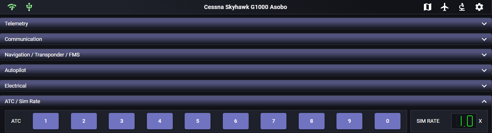
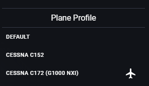
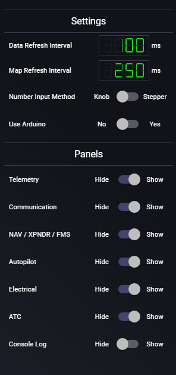
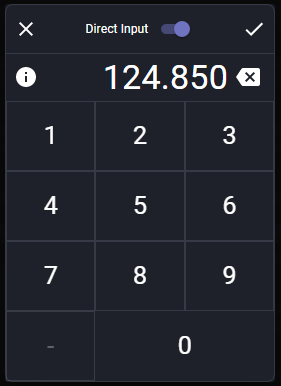
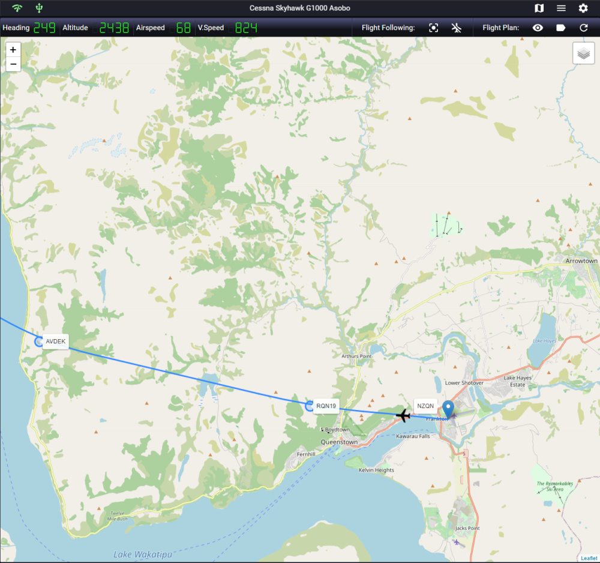
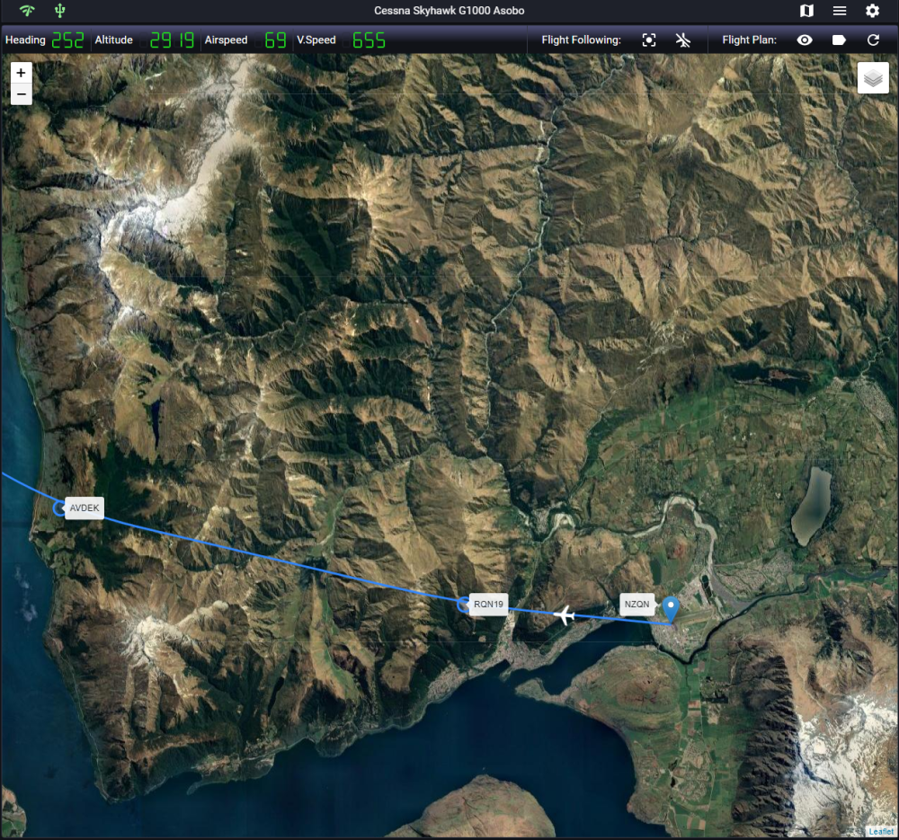

# MSFS Touch Panel User Guide

# Main Screen
The Main screen contains most of the flight control functions and are touch enabled. Each panel can be collapsed to display only what is needed at that moment. Panels can also be hidden via the [Configuration Settings](#configuration-settings) menu.

  
   

## Menu Bar

The menu bar displays the current connection status of the application as well as buttons to show configuration settings. It also displays the current active plane profile.

Explanation of menu bar icons from the left to right:

* Connection status to MSFS - This will become active when MSFS/SimConnect is connected.
* Connection status for Arduino - This will become active if Arduino is connected.
* [Switch to map screen](#map-screen)
* Plane profile settings

	The corresponding plane profile will automatically activate when you select the desired plane for simulation. You can also manually select another plane profile but some plane functions may not work correctly. More plane profiles will be added in future releases.
				
	

* Experimental feature - This is used by experimental feature to go back and forth between the application and the experimental screens.
* Configuration Settings

	The configuration settings allow you to adjust various features of the application.
			
	
		
	* **Data Refresh Interval** - data will refresh every X milliseconds. The valid refresh rate is between 50ms to 5000ms. If the application seems slow or unresponsive, you can increase the refresh interval. The refresh interval will affect how fast the telemetry and UI is being updated. For any recently built computer, the lowest refresh interval will work just fine.		
	* **Map Refresh Interval** - map will refresh every X milliseconds. The valid refresh rate is between 50ms to 5000ms. When using plane following, the map will move smoother when using lower refresh interval.
	* [Number Input Method](#input-method) - when not using direct input, you can either use the knob method or stepper method to input data.
	* [Use Arduino](#arduino-input-method) - enable input using Arduino hardware.
	* **Panels** - show or hide the selected panel on the main screen. The show/hide panel configuration is saved per plane configuration. 

## Panels
The flight control panels consist of some of the frequently use functions during simulation. The use of the panel is pretty self-explanatory. For any of the button, when active (such as Autopilot Master), it will light up in green. Any button or input that can be selected or changed, it will light up orange when hover or press. For numeric entry, a corresponding popup panel will be available for input when press.

## Input Method

There are 4 ways to input data into flight control. For choosing direct input or non-direct input, your configuration will be saved for the individual inputs. For example, if you want to use direct input for NAV/COM and knob input for Autopilot heading, you can do that!

* Direct Input

	
	
	* 	You can enter numeric data directly using the popup number pad. The accept ('Check') button will not light up if the number you enter is invalid. For example, if you try to enter 199.000 for COM radio, the "Check" button will not light up. Also, invalid keypad number will be disabled for the input field where applicable. 
	
	* When you hover or long press the information "i" icon on the left of the number display, the valid data value for the input field will be displayed.
	
	* To exit or cancel your input, either press the "X" button or press anywhere outside the number pad popup.
	
	* To switch between direct input or knob/stepper input, you can press the "Direct Input" switch at the top. The popup will change to either knob or stepper input that is configured in the [Configuration Settings](#configuration-settings) menu.
	 

* Knob Input Method

	

	* 	For a more immersive and fun way to enter data. The dual knobs behaves exactly like the dual knob control in flight instrument panel within the simulation. 
	 
	*	Depending on the input field, there maybe only a single knob for the input instead of dual knobs.
	
	*	To accept the input value, press the "Check" button in the upper right corner.
	
	* 	To exit or cancel your input, either press the "X" button or press anywhere outside the knob pad popup.
	
	* 	To switch between direct input or knob input, you can press the "Direct Input" switch at the top. The popup will change to direct input number pad for data entry.

* Stepper Input Method

	

	* 	If you prefer, the stepper input gives a set of small arrows and a set of big arrows to input data. The small arrows change the data value in a smaller increment and the big arrows change the data value in a bigger increment. 
	 
	*	Depending on the input field, there maybe only one set of arrows for the data input.
	
	*	To accept the input value, press the "Check" button in the upper right corner.
	
	* 	To exit or cancel your input, either press the "X" button or press anywhere outside the stepper pad popup.
	
	* 	To switch between direct input or stepper input, you can press the "Direct Input" switch at the top. The popup will change to direct input number pad for data entry.

## Arduino Input Method

For the most immersive experience, using couple of Arduino rotary encoders and a joystick control is a super fun way to manage the in-flight controls. Currently, the application utilizes two rotary encoders and a joystick for input.

Please see technical design [here](TechnicalDetail.md#arduino) in how to build the Arduino hardware controls. 

Once the Arduino hardware controls are connected to the application, you can easily change any numeric input fields such as COM standby or NAV standby by just pressing on the field in the application. The Arduino encoder(s) will become active immediately to control that particular input field. This is pretty similar to Sim Innovations' knobster control. I called it the poor man's Knobster! Thanks for Sim Innovations' designers for their idea of Knobster.

Here is an example of how the Arduino control will work:

By activating the COM1 standby field in the application, rotary encoder one will change the MHz value of the radio and rotary encoder two will change the KHz value of the radio. The rotary encoder switch will perform the swap to use from standby once the desire radio frequency is entered.

The joystick control currently has minimal functionality. It is designed to pan the map in the G1000 NXi interface (map panning doesn't work yet in G1000 NXi 0.6 addon as of this writing). The joystick can also be used to switch between fields in the FMS. 

## G1000 NXi PFD/MFD
For the initial release, G1000 NXi PFD/MFD controls are included. You can launch the control of each function panel by selecting PFD or MFD button on the main screen. ***To use the softkey buttons feature of seeing the real-time softkey labels, you must run the [installation](plugin-extension/G1000NXi/README.md) procedure to add support. Otherwise, the softkeys will still work but the labels will be blank.***

* At the top of the input panel, a list of softkeys correspond to the PFD/MFD soft buttons at the bottom of the instrumentation panel in MSFS. These softkeys can be activated just like the in-flight panel.

* The dual knob input mirrors the upper and lower FMS in-flight FMS knob. 

* In Arduino, the hardware encoder knob switch buttons also function as CLR and ENT button. 

* There are two additional button to the bottom right, MAP and FMS. By selecting MAP, the knob input will change to map range input control to zoom in and zoom out of the map. A set of joystick buttons will also be available for map panning (currently G1000 NXi map panning doesn't work yet as of v0.6 of the plugin). To get out of MAP control, just select the FMS button or any other input panel buttons to return control to the FMS knob input.

# Map Screen

The map screen gives you a prettier VFR map compare to the MSFS built-in VFR Map. 

  
   

It includes the following features:

* Current flight data display - Heading, Altitude, Airspeed, and Vertical Speed.
* Enable/disable flight following (by dragging to different location on the map, flight following is automatically disable).
* Center plane - set current plane location to the center of the map.
* Show flight plan - current flight plan will be automatically loaded if available.
* Show flight plan label - display waypoint's label and expected altitude at that waypoint.

For the map overlay, you can select it by pressing on the overlay icon at the upper right hand corner of the map. The map display uses OpenStreet map as default. The following map types are also available for selection:

* Topography map
* Dark version of map
* Google Street
* Google Terrain
* Google Satellite
* Google Hybrid
* Aviation Overlay

The current flight path is being drawn with a smooth curve based on Quadratic Bézier Curve calculation instead of straight line from waypoint to waypoint. In future release, I will experiment with various path drawing techniques to continue improve the visual quality of the flight path.
