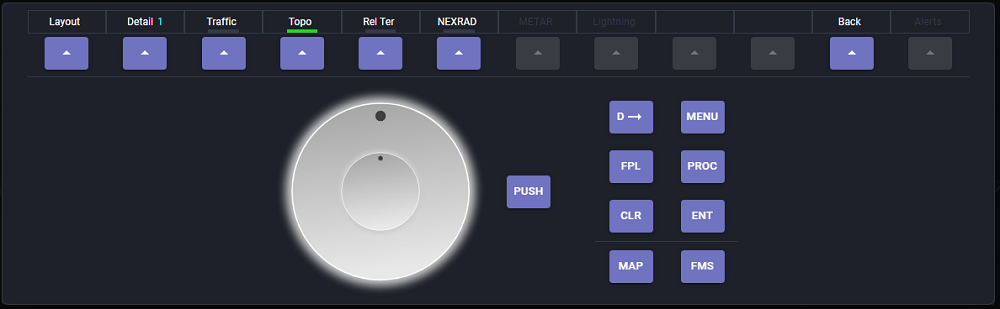

# G1000 NXi Patch

The files in this folder will be used to patch G1000NXi marketplace addon to allow output of new LVAR values for PFD and MFD softkey labels. These labels will be displayed in the PFD and MFD UI control in the application. Without patching, the softkeys will still work but the label will not be shown.

## How to Patch

Please run patch.ps1 in Powershell command window to execute the patch. Backups of the original files will be created before any patch occurs against the folders below.

The 2 files that are being patched:

<MSFS installation folder>\Official\OneStore\workingtitle-g1000nxi\html_ui\Pages\VCockpit\Instruments\NavSystems\WTG1000\PFD\PFD.js
<MSFS installation folder>\Official\OneStore\workingtitle-g1000nxi\html_ui\Pages\VCockpit\Instruments\NavSystems\WTG1000\MFD\MFD.js

## If Something Goes Wrong
Please uninstall and reinstall the G1000 NXi plugin from the marketplace and everything should be back to normal. Or place the original file in the above folders with the backup file.

## Technical Info

In order to get softkey labels and statuses for the PFD/MFD panel, LVAR values have to be output from the simulator. Unfortunately, LVAR can only output as double value which need to encode the following information and send to the application. These info are:

* Softkey label
* Is the softkey menu disable
* Can the softkey menu be toggled
* If the softkey menu can be toggled, what is the status (On vs Off)
* If the softkey menu is a string and has additional status value, what is the status value

So to encode these information, a unique double value is given for each softkey label using the patched JavaScript object. This double value is being sent out from G1000 NXi PFD.js and MFD.js when the softkey button is pressed.

For example, for the MFD Softkey-1 with label of "Engine", it has a value of 101.

* To get the label, divide the double value by 100 which will give you 1 (the label's JavaScript value).

* To get the remaining info, modular the double value by 100 and get the integer result which is 1. Then convert this to a 3-bit hexadecimal which is 0x001.

* The 3-bit hexadecimal represents from right to left: 

	Bit #1 (menu enable = 1, menu disable - 0)
	
	Bit #2 (menu can be toggled = 1, menu cannot be toggled - 0)
	
	Bit #3 (menu toggle on = 1, menu toggle off - 0)

Addition dynamic label info is represented in the decimal part of the double value. Multiply the decimal by 100 to get the dynamic label value ID.
	
